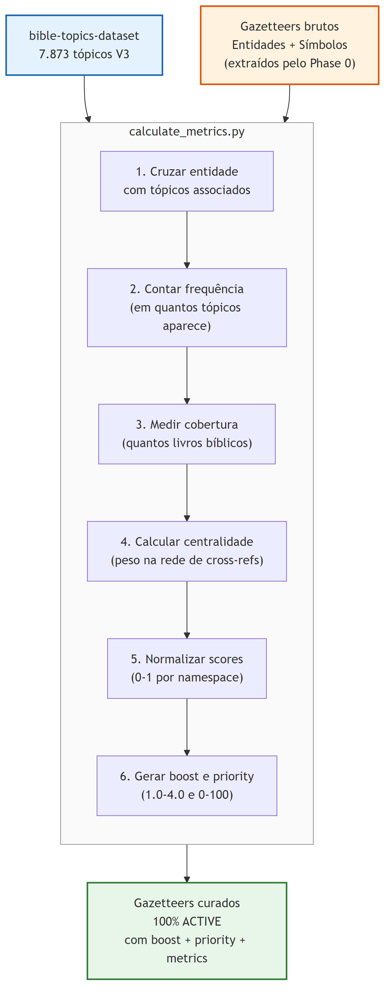
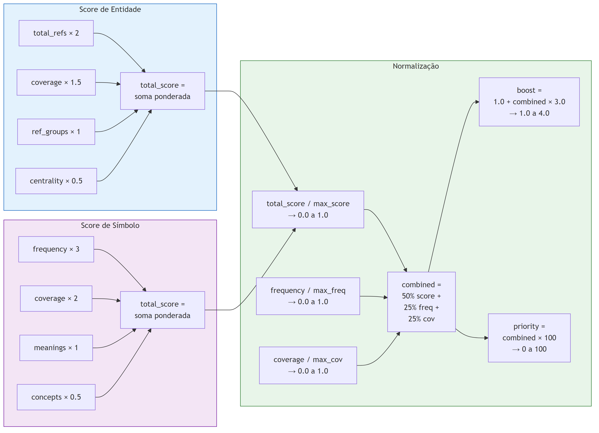

# Methodology

How the biblical gazetteers are created, curated, and scored.

## Dependencies

This dataset is derived from other NEUU datasets. The metrics calculation requires:

| Dependency | Repository | Used for |
|-----------|-----------|----------|
| **Topics V3** | [bible-topics-dataset](https://github.com/neuu-org/bible-topics-dataset) | Source of entities/symbols (Phase 0 extraction) + metrics calculation |
| **Cross-references** | [bible-crossrefs-dataset](https://github.com/neuu-org/bible-crossrefs-dataset) | Centrality metrics (cross_reference_network in topics) |
| **Bible text** | [bible-text-dataset](https://github.com/neuu-org/bible-text-dataset) | Biblical book coverage calculation |

The gazetteers are **downstream** of the topics pipeline — as more topics are enriched, the gazetteers grow and metrics improve.

```
bible-topics-dataset (7,873 topics)
        ↓ Phase 0 (AI extraction)
bible-gazetteers-dataset (entities + symbols + relationships)
        ↓ calculate_metrics.py
Curated gazetteers (100% ACTIVE with boost/priority)
```

## Metrics Glossary

Quick reference for all metrics used in this dataset:

| Metric | Applies to | Range | Meaning |
|--------|-----------|-------|---------|
| **frequency** | Both | 0 — N | How often this entry appears across the topics corpus |
| **coverage** | Both | 0 — 66 | How many distinct biblical books reference this entry (max 66 canonical books) |
| **centrality** | Entities | 0 — N | Importance in the cross-reference network: how many intertextual connections pass through associated topics |
| **total_refs** | Entities | 0 — N | Total biblical references (OT + NT) in all associated topics |
| **ref_group_count** | Entities | 0 — N | Number of distinct study aspects/reference groups in associated topics |
| **meaning_richness** | Symbols | 0 — N | Number of distinct symbolic meanings (e.g., water = purification, judgment, Spirit, rebirth) |
| **concept_connections** | Symbols | 0 — N | Number of theological concepts associated (e.g., water → baptism, eternal life) |
| **total_score** | Both | 0 — N | Weighted composite score (see formulas below) |
| **boost** | Both | 1.0 — 4.0 | Normalized search ranking weight. 4.0 = most important in its namespace |
| **priority** | Both | 0 — 100 | Normalized ordering priority for NLP entity matching |
| **status** | Both | ACTIVE | Curation status. ACTIVE = metrics calculated, ready for use |

## Pipeline Overview



The gazetteers are built in two phases:

1. **Extraction** (Phase 0 of the topical pipeline): AI analyzes each topic in the [bible-topics-dataset](https://github.com/neuu-org/bible-topics-dataset) and extracts entities, symbols, and relationships.

2. **Curation** (`calculate_metrics.py`): Each entry is scored against the full V3 topics corpus (7,873 topics) to compute importance metrics, boost, and priority.

## How Entities Are Extracted

During Phase 0 of the topical pipeline, GPT-4o-mini processes each topic and extracts:

- **Entities**: people, places, concepts, objects, events mentioned in the topic
- **Symbols**: natural elements, objects, actions with literal and symbolic meanings
- **Relationships**: connections between entities (parent, ally, enemy, spouse, etc.)

Each entity is classified into a **namespace** (PERSON, PLACE, CONCEPT, etc.) with a **type** within that namespace (e.g., PERSON > KING, PERSON > PROPHET).

## How Metrics Are Calculated

The `calculate_metrics.py` script crosses each gazetteer entry with the topics V3 dataset to compute real importance metrics.

### Entity Metrics

For each entity, the script looks at all topics where it appears (`source_topics`) and calculates:

| Metric | What it measures | Source |
|--------|-----------------|--------|
| **frequency** | How many V3 topics mention this entity | Count of `source_topics` |
| **coverage** | How many distinct biblical books reference it | `biblical_references[].book` in associated topics |
| **centrality** | Weight in the cross-reference network | `cross_reference_network.as_source` + `as_target` in topics |
| **total_refs** | Total biblical references in associated topics | `stats.ot_refs` + `stats.nt_refs` |
| **ref_group_count** | Number of study aspects/groups | `reference_groups[]` count in topics |

**Entity total_score formula:**

```
total_score = (total_refs × 2) + (coverage × 1.5) + ref_group_count + (centrality × 0.5)
```

Weights reflect that direct biblical evidence (`total_refs`) is most important, followed by breadth across books (`coverage`), then study depth (`ref_groups`), then network position (`centrality`).

### Symbol Metrics

For each symbol, the script uses the symbol's own data:

| Metric | What it measures | Source |
|--------|-----------------|--------|
| **frequency** | How many concrete biblical examples | Count of `bible_examples[]` |
| **coverage** | How many distinct books in the examples | Books extracted from `bible_examples[].ref` |
| **meaning_richness** | How many different symbolic meanings | Count of `symbolic_meaning[]` |
| **concept_connections** | How many theological concepts linked | Count of `associated_concepts[]` |

**Symbol total_score formula:**

```
total_score = (frequency × 3) + (coverage × 2) + meaning_richness + (concept_connections × 0.5)
```

Biblical examples (`frequency`) have the highest weight because they represent concrete scriptural evidence. Coverage matters because symbols that span multiple books are theologically richer.

### Boost and Priority (Normalized)



After computing raw metrics, the script normalizes them **per namespace** (so PERSON scores are compared to other PERSONs, not to PLACEs):

```
norm_score = total_score / max_total_score_in_namespace
norm_freq  = frequency / max_frequency_in_namespace
norm_cov   = coverage / max_coverage_in_namespace

combined = (norm_score × 0.5) + (norm_freq × 0.25) + (norm_cov × 0.25)
```

Then maps to final values:

| Output | Range | Formula | Purpose |
|--------|-------|---------|---------|
| **boost** | 1.0 — 4.0 | `1.0 + (combined × 3.0)` | Search ranking weight — higher = more prominent in results |
| **priority** | 0 — 100 | `combined × 100` | Ordering priority for NLP matching |

### What Boost Means in Practice

When the NLP search engine encounters "Jerusalem" in a query, the **boost of 4.0** makes it weigh 4x more than an entity with boost 1.0. This ensures that central biblical entities (Jerusalem, Christ, Moses) rank higher than minor mentions.

| Boost | Meaning | Example |
|-------|---------|---------|
| 3.5 — 4.0 | Central to biblical narrative | Jerusalem, Christ, Moses, Isaiah |
| 2.5 — 3.5 | Important but less central | Elijah, Damascus, Covenant |
| 1.5 — 2.5 | Moderate presence | Zephaniah, Tarsus |
| 1.0 — 1.5 | Minimal presence | Single-mention entities |

## Current Top Entities

| Rank | Entity | Namespace | Boost | Frequency | Coverage |
|------|--------|-----------|-------|-----------|----------|
| 1 | Jerusalem | PLACE | 4.00 | 106 topics | 105 books |
| 2 | Satan | ANGEL | 4.00 | 13 topics | 44 books |
| 3 | Christ | DEITY | 3.96 | 105 topics | 113 books |
| 4 | Ezekiel | PERSON | 3.89 | 103 topics | 109 books |
| 5 | Isaiah | PERSON | 3.80 | 119 topics | 107 books |
| 6 | God | DEITY | 3.76 | 91 topics | 113 books |
| 7 | Jeremiah | PERSON | 3.73 | 100 topics | 109 books |
| 8 | Moses | PERSON | 3.66 | 96 topics | 111 books |

## Incremental Updates

As the topical pipeline processes more topics (currently 48.7% AI-enriched), new entities and symbols are extracted. To update metrics:

```bash
python scripts/calculate_metrics.py \
    --topics-dir ../bible-topics-dataset/data/01_unified
```

This recalculates all scores and updates status to ACTIVE. The script is **idempotent** — running it multiple times produces the same result for the same input.

## Limitations

- **Entity descriptions**: 19% of PERSON entities still have generic descriptions ("Personagem presente na narrativa biblica"). These improve as more topics are processed.
- **Aliases**: Most entities have only 1 alias. Cross-lingual aliases (EN, ES) are not yet generated.
- **Relationships**: Extracted from AI analysis, not manually curated. May contain errors.
- **Namespace overlap**: Some entries could belong to multiple namespaces (e.g., David is both PERSON and LITERARY_WORK as psalm author).
